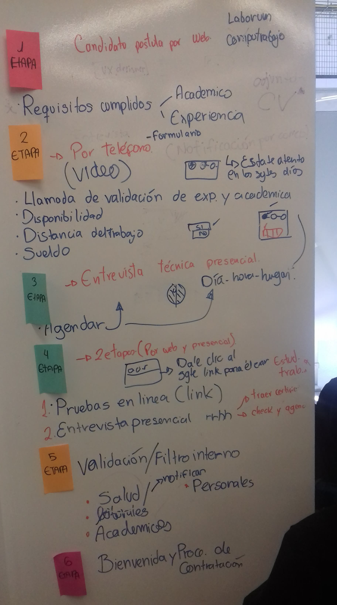
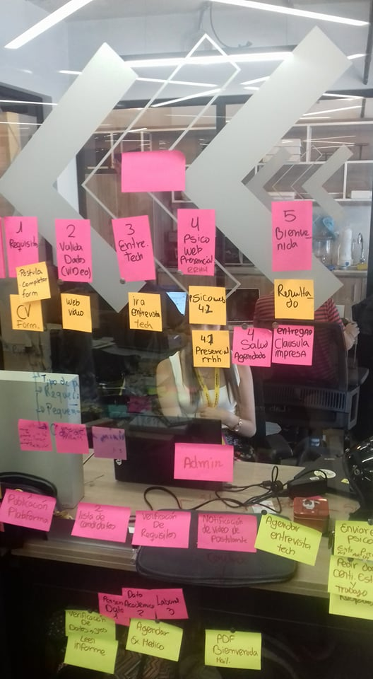
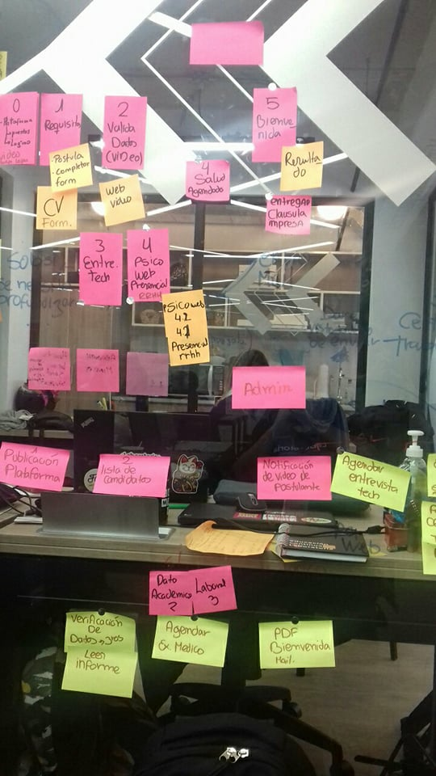
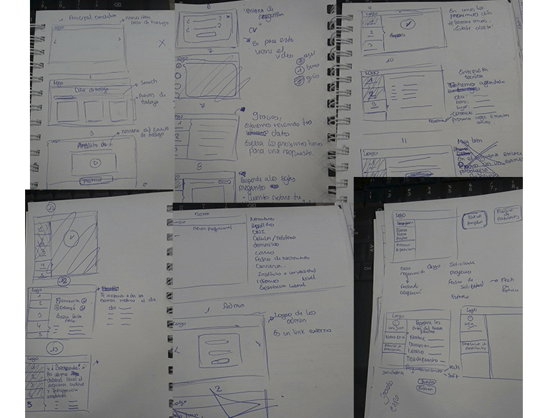
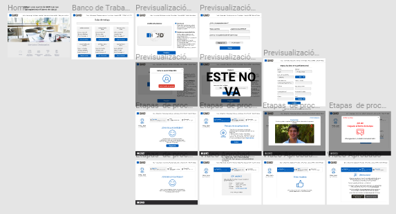
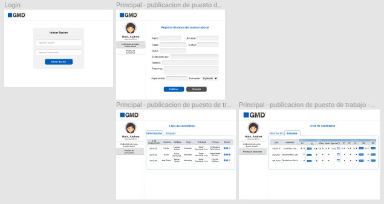

# GMD - Proceso de selección

GMD es una empresa Outsourcing de procesos de Negocios, Tecnología de la Información(TI) y Transformación Digital con mayor confiabilidad y experiencia del Perú.
___
## Desarrollado para GMD

> Reto: Rediseñar el proceso de reclutamiento y selección de GMD, con el objetivo de reducir el tiempo de contratación y considerando el uso de las más novedosas tecnologías (IA, Analytics, Gaming)

### Descubrimiento e investigación

* Investigación y proceso actual de selección:
Se realizáron entrevistas a los stakeholders de GMD, personal del area de RRHH.

En base al flujo actual que ellas toman se realizó una guía de ello:

Primer flujo propuesto en base al flujo del postulante y del reclutador:

Luego de ello se iteró el flujo propuesto en base a la minimificación del proceso:

### Prototipo:
* P. Baja fidelidad: 

* P. Alta fidelidad del Postulante:

* P. Alta fidelidad del reclutador:

[Click Aquí para ver el prototipo en acción!](https://marvelapp.com/cfc6ae4/screen/41132338)

### Feedback:
* Proceso guiado y amigable.
* Textos amigables para el usuario postulante.
* Número de postulantes, métrica de etapas, porcentajes.
* En caso si el usuario tiene un perfil al cual puede volver a ser convocado, que se realice.
* Proponer lecturas sugeridas - Reglamento interno de trabajo, reglamento interno de salud y seguridad en el trabajo.
* Mostrar un campo de puesto laboral en Estados.
* Debería de mostrar informes y descargarlo.
* Debería de mostrar el estado final del postulante en la interfase del postulante.
* Agregado de observación, para el ingreso de comentarios del administrador.

### Herramientas utilizadas:

* Front-end:
   - HTML, CSS, Javascript
   - API - uploadCare
   - framework - Semantic UI 
   - Firebase

* UX:
    - Entrevistas a stakeholders
    - Research en base a sus procesos actuales
    - Figma
    - Marvel
